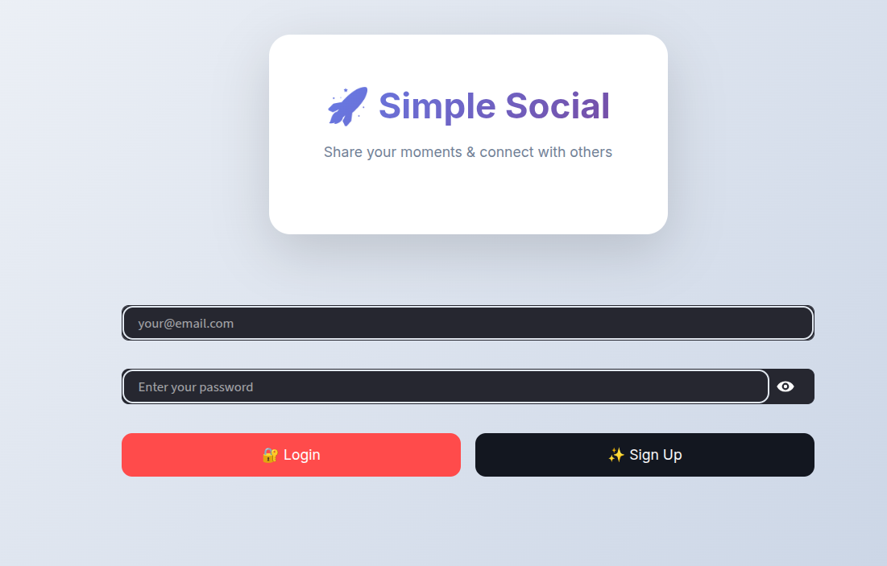
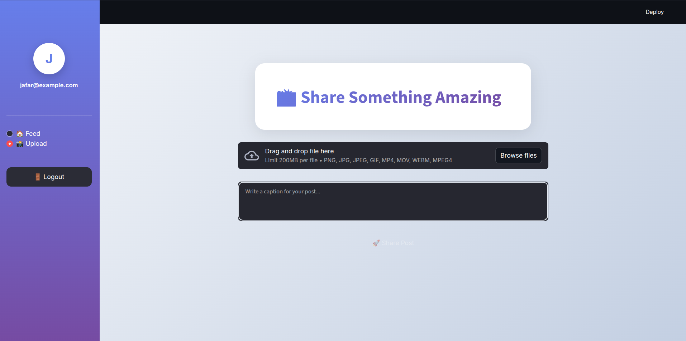
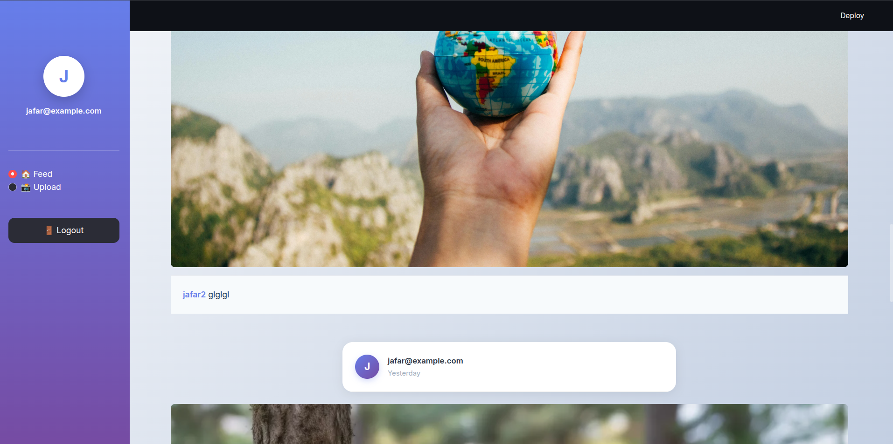

# FastAPI SocialHub

A minimalist social media backend built with FastAPI, demonstrating core backend engineering skills: authentication, file uploads, and user-generated content APIs. The frontend (Streamlit) is for demonstration only — this project highlights robust, maintainable FastAPI techniques.

---

## 🚀 Main Features

- **User Authentication**: Secure JWT-based authentication and registration.
- **File Uploads**: Support for images and videos up to 200MB per file.
- **User Feed**: Timeline/feed APIs to fetch and manage posts.
- **Media Serving**: Direct image/video streaming from backend storage.
- **Enterprise Practices**: Async endpoints, type-safe Pydantic models, clear API separation, input validation, and strong error handling.

---

## 🛠️ Technologies Used

- **FastAPI** – Modern async Python web framework
- **Uvicorn** – ASGI server for high performance
- **Pydantic** – Data validation and type hints
- **PyJWT / python-jose** – JWT Authentication
- *(Database/ORM depends on your implementation; update if needed)*
- **Streamlit** (for the demo UI only)

---

## 🗂️ Project Structure (Backend Only)
<pre>
├── app/
│   ├── main.py         # Uvicorn entrypoint, FastAPI app
│   ├── routers/        # API endpoints: auth, posts, upload
│   ├── models/         # Pydantic schemas
│   ├── db.py           # Database connection/utilities
│   └── ...             # Other backend modules
└── frontend.py         # Streamlit demo UI (not core focus)
</pre>

---

## 📸 Screenshots





---

## ⚡ Quickstart

```bash
# Clone the repo
git clone https://github.com/yourusername/fastapi-socialhub.git
cd fastapi-socialhub

# (Recommended) Create a virtual environment
python3 -m venv venv
source venv/bin/activate

# Install backend requirements with uv
uv pip install -r requirements.txt

# Start the FastAPI app (dev mode)
uvicorn app.app:app --reload
```

*For the Streamlit demo UI:*
```bash
uv pip install streamlit
uv streamlit run frontend.py
```
---

## ❗ Notes

- **Frontend (UI) is a minimal demonstration, not production-grade.** All backend code is designed per FastAPI best practices.
- **Main focus: robust backend skills** — API security, async operations, scalability, maintainability, & enterprise-friendly code patterns.

---

## 🧑‍💻 Author

Inspired and maintained by Jafar Alkhodor.

---

## License

MIT
